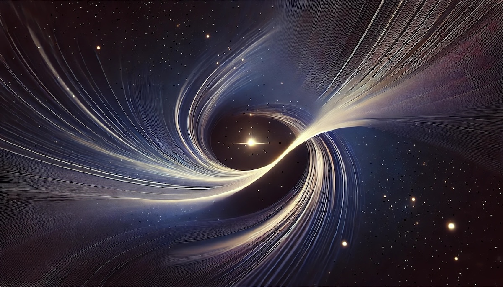

# Temporal-Spatial Coupling in Gravitational Lensing: A Reinterpretation of Dark Matter Observations

[](https://doi.org/10.5281/zenodo.17982540)
[](https://creativecommons.org/licenses/by/4.0/)



**Author:** Matthew Lukin Smawfield  
**Version:** v0.7 (Tortola)  
**Date:** First published: 19 December 2025 · Last updated: 10 August 2026
**Status:** Preprint  
**DOI:** [10.5281/zenodo.17982540](https://doi.org/10.5281/zenodo.17982540)  
**Website:** [https://matthewsmawfield.github.io/TEP-GL/](https://matthewsmawfield.github.io/TEP-GL/)

## Abstract

Standard gravitational lensing analysis relies on the *Isochrony Axiom*—the implicit assumption that the observed image represents a synchronous spatial snapshot of the source. For evolving sources, this approximation breaks down in the presence of conformal metric couplings, creating a "temporal composite" image. This projects temporal depth onto the spatial plane, generating a *Temporal-Composite Shear* contribution sourced by the underlying *Temporal Shear* field gradient—arising from gradients in the scalar field's continuous spatial profile (*Temporal Topology*, TEP)—that is degenerate with gravitational shear in standard static lens reconstructions unless time-domain or variability-dependent observables are included. This contribution forms one component of the *Phantom-Mass* phenomenology defined here. GW170817 primarily constrains differential propagation and disformal cone tilt; it does not directly test common-mode conformal clock-rate structure along a shared path, although conformal scalar sectors remain indirectly constrained by PPN, equivalence-principle, source-screening, and clock-comparison tests. Because photons and gravitational waves traverse the same path, conformal time dilation is common-mode and cancels in differential measurements. Screening operates via the continuous flattening of Temporal Topology in dense environments, suppressing local field gradients without invoking discrete thin-shell boundaries. Conformal gradients may reproduce specific timing-sensitive aspects of dark-matter-like phenomenology—particularly in the time domain—without violating strong-lens arrival time constraints. Within TEP, the phenomena conventionally attributed to dark matter are real, but the inference of an invisible particulate substance is rejected. TEP interprets the dark sector as Phantom Mass: an apparent convergence, shear, or dynamical mass discrepancy generated when temporal-transport structure is reconstructed under the Isochrony Axiom as synchronous spatial mass. The theory-level claim is stronger than the paper-level evidence claim: within TEP, particulate dark matter is rejected as the fundamental explanation, while this paper tests the lensing-sector realization of that ontology. These results are derived in two regimes: a conservative Reference Envelope (millisecond-scale corrections, directly testable with lensed FRBs) and an Extended Regime (year-scale chronometric corrections and a full lensing-sector dark-sector reinterpretation), whose coherent and source-dependent components are independently testable through blind time-delay residuals, lensing consistency tests, and variability-dependent observables. Within the Extended Regime, where the Isochrony Axiom fails, temporal-field gradients produce an observational degeneracy with particulate dark matter. The Reference Envelope result is the primary, unconditional contribution; the Extended Regime is conditional.

The continuous flattening of the Temporal Topology in dense lensing environments is governed by the abstract environmental operator S_Sigma(E). By projecting temporal depth onto the spatial plane, this continuous geometric screening generates the conformal/chronometric component of the *Phantom-Mass* phenomenology.

## The TEP Research Program

| Paper | Repository | Title | DOI |
|-------|-----------|-------|-----|
| **Paper 0** | [TEP](https://github.com/matthewsmawfield/TEP) | Temporal Equivalence Principle: Dynamic Time & Emergent Light Speed | [10.5281/zenodo.16921911](https://doi.org/10.5281/zenodo.16921911) |
| **Paper 1** | [TEP-GNSS](https://github.com/matthewsmawfield/TEP-GNSS) | Global Time Echoes: Distance-Structured Correlations in GNSS Clocks | [10.5281/zenodo.17127229](https://doi.org/10.5281/zenodo.17127229) |
| **Paper 2** | [TEP-GNSS-II](https://github.com/matthewsmawfield/TEP-GNSS-II) | Global Time Echoes: 25-Year Analysis of CODE Precise Clock Products | [10.5281/zenodo.17517141](https://doi.org/10.5281/zenodo.17517141) |
| **Paper 3** | [TEP-GNSS-RINEX](https://github.com/matthewsmawfield/TEP-GNSS-RINEX) | Global Time Echoes: Raw RINEX Consistency Test | [10.5281/zenodo.17860166](https://doi.org/10.5281/zenodo.17860166) |
| **Paper 4** | **TEP-GL** (This repo) | Temporal-Spatial Coupling in Gravitational Lensing: A Reinterpretation of Dark Matter Observations | [10.5281/zenodo.17982540](https://doi.org/10.5281/zenodo.17982540) |
| **Paper 5** | [TEP-GTE](https://github.com/matthewsmawfield/TEP-GTE) | Global Time Echoes: Empirical Synthesis | [10.5281/zenodo.18004832](https://doi.org/10.5281/zenodo.18004832) |
| **Paper 6** | [TEP-UCD](https://github.com/matthewsmawfield/TEP-UCD) | Universal Critical Density: Cross-Scale Consistency of ρ_T | [10.5281/zenodo.18064365](https://doi.org/10.5281/zenodo.18064365) |
| **Paper 7** | [TEP-RBH](https://github.com/matthewsmawfield/TEP-RBH) | The Soliton Wake: Exploring RBH-1 as a Temporal Topology Candidate | [10.5281/zenodo.18059250](https://doi.org/10.5281/zenodo.18059250) |
| **Paper 8** | [TEP-SLR](https://github.com/matthewsmawfield/TEP-SLR) | Global Time Echoes: Optical-Domain Consistency Test via Satellite Laser Ranging | [10.5281/zenodo.18064581](https://doi.org/10.5281/zenodo.18064581) |
| **Paper 9** | [TEP-EXP](https://github.com/matthewsmawfield/TEP-EXP) | What Do Precision Tests of General Relativity Actually Measure? | [10.5281/zenodo.18109760](https://doi.org/10.5281/zenodo.18109760) |
| **Paper 10** | [TEP-COS](https://github.com/matthewsmawfield/TEP-COS) | The Temporal Equivalence Principle: Suppressed Density Scaling in Globular Cluster Pulsars | [10.5281/zenodo.18165798](https://doi.org/10.5281/zenodo.18165798) |
| **Paper 11** | [TEP-H0](https://github.com/matthewsmawfield/TEP-H0) | The Cepheid Bias: Resolving the Hubble Tension | [10.5281/zenodo.18209702](https://doi.org/10.5281/zenodo.18209702) |
| **Paper 12** | [TEP-JWST](https://github.com/matthewsmawfield/TEP-JWST) | The Temporal Equivalence Principle: A Unified Resolution to the JWST High-Redshift Anomalies | [10.5281/zenodo.19000827](https://doi.org/10.5281/zenodo.19000827) |
| **Paper 13** | [TEP-WB](https://github.com/matthewsmawfield/TEP-WB) | The Temporal Equivalence Principle: Temporal Shear Recovery in Gaia DR3 Wide Binaries | [10.5281/zenodo.19102061](https://doi.org/10.5281/zenodo.19102061) |
| **Paper 15** | [TEP-EFA](https://github.com/matthewsmawfield/TEP-EFA) | Temporal Equivalence Principle: Temporal Shear in the Earth Flyby Anomaly | [10.5281/zenodo.19454863](https://doi.org/10.5281/zenodo.19454863) |
| **Paper 16** | [TEP-J0437](https://github.com/matthewsmawfield/TEP-J0437) | Synchronization Holonomy in Pulsar Scintillation | [10.5281/zenodo.19454620](https://doi.org/10.5281/zenodo.19454620) |
| **Paper 17** | [TEP-LLR](https://github.com/matthewsmawfield/TEP-LLR) | Lunar Laser Ranging and the Nordtvedt Effect | [10.5281/zenodo.19446029](https://doi.org/10.5281/zenodo.19446029) |

When using this work, please cite the paper and theoretical framework listed below.

## Key Findings

This paper identifies a nuanced aspect of multi-messenger constraints: GW170817 bounds differential propagation speeds (disformal sector) but does not directly test common-mode conformal clock-rate structure along the shared path, although conformal scalar sectors remain indirectly constrained by PPN, equivalence-principle, source-screening, and clock-comparison tests. If time flows at different rates across an extended source, the observed image becomes a "temporal composite" that projects temporal depth onto the spatial plane. This temporal shear—arising from gradients in the scalar field's continuous spatial profile (Temporal Topology, TEP)—is degenerate with gravitational shear in standard static lens reconstructions unless time-domain or variability-dependent observables are included, forming one component of the Phantom-Mass phenomenology that mimics dark matter. Screening operates via the continuous flattening of Temporal Topology in dense environments, suppressing local field gradients without invoking discrete thin-shell boundaries. No securely multiply-imaged FRB with a published independent lens model is available at the time of writing, so no lensed-FRB residual is claimed here as evidence; the required observational protocol is specified in Section 5.1. Unlike dark matter models, TEP-GL predicts unique signatures: variability-dependent Phantom Mass and non-zero curl (image rotation) in the shear tensor.

---

## Core Hypothesis

If the Isochrony Axiom is violated by differential time dilation (conformal metric coupling), extended images become temporal composites. This projects temporal depth onto the spatial plane, generating a Temporal Shear contribution—arising from gradients in the scalar field's continuous spatial profile (Temporal Topology, TEP)—that is degenerate with gravitational shear in standard static lens reconstructions unless time-domain or variability-dependent observables are included—a contribution forming one component of the Phantom-Mass phenomenology defined here.

GW170817 primarily constrains differential propagation and disformal cone tilt; it does not directly test common-mode conformal clock-rate structure along a shared path, although conformal scalar sectors remain indirectly constrained by PPN, equivalence-principle, source-screening, and clock-comparison tests. Because photons and gravitational waves traverse the same null geodesics in the conformal limit, time dilation is common-mode and cancels in differential measurements. Conformal gradients can reproduce specific aspects of dark matter phenomenology—particularly coherent lensing shear and time-domain signatures—subject to continuous geometric screening constraints (Temporal Topology). The component conventionally attributed to dark matter may contain an unmodeled temporal-transport contribution.

## Key Predictions

1. **Variability Bias**: The inferred "dark matter" mass should correlate with the intrinsic variability of the source. Static sources should show less phantom mass than variable sources.
   
2. **Image Rotation (Non-Zero Curl)**: Unlike scalar-potential gravitational lensing (which is curl-free), the **Temporal Shear Tensor** possesses a non-zero curl, predicting unique image rotation effects.

3. **Chronometric Lensing**: Fast transients (FRBs) should exhibit millisecond-scale achromatic arrival-time residuals ("jitter") that cannot be explained by geometric time delays or plasma dispersion.

4. **Achromaticity**: Like dark matter, the temporal effect is wavelength-independent.

5. **Convergence of Evidence**: Existing cosmological tensions (S₈, H₀, flux ratio anomalies) converge on TEP-GL phenomenology—the framework provides a unified explanation for multiple independent anomalies.

## Observational Discriminants

The manuscript proposes several tests to distinguish temporal-field effects from dark matter:

- **Source Evolution Analysis**: Compare apparent dark matter fraction vs source evolutionary timescale
- **Variable Source Monitoring**: Track morphological changes in strongly lensed AGN/quasars
- **Multi-Image Spectroscopy**: Search for evolutionary signatures between multiple images
- **Statistical Surveys**: Correlate lensing anomalies with source properties

### Lensed-FRB Test Protocol

No securely multiply-imaged FRB with a published independent lens model is currently available, so no lensed-FRB residual is claimed as evidence. The prediction is stated as an identifiable measurement of the blind-prediction residual `R_ij = Δt_ij(obs) − Δt_ij(GR)`, where the GR prediction is frozen from an independent lens model beforehand:

| Required element | Specification |
|------------------|---------------|
| Secure multiple imaging | Consistent localization and repeated burst morphology across images |
| Independent lens model | Frozen, pre-registered `Δt_ij(GR)` with propagated model uncertainty |
| Observed delay | `Δt_ij(obs)` at high time resolution, plasma-corrected |
| Residual | `R_ij`, with plasma, microlensing and host-scattering budgets subtracted |
| Discriminator | Achromatic residual, non-zero ensemble mean, correlated with path environment |

Priority targets: FRB 20190520B exhibits a DM excess (~900 pc cm⁻³) that could partially conceal an achromatic temporal delay, and FRB 20190308C is a reported lensed candidate in the CHIME catalog.

## Theoretical Framework

This work builds on the Temporal Equivalence Principle (TEP), which proposes:
-   **Gravity is Geometry; Time is a Dynamical Field.**
-   The decomposition of proper time accumulation into "mass" and "time dilation" is **gauge-dependent**.
-   **Sector Decoupling**: The Conformal Sector (clock rates) is unconstrained by GW170817, while the Disformal Sector (speed of transmission) is tightly bound.
-   **Temporal Shear Suppression**: The "Screening Cliff" objection is addressed through continuous geometric gradient suppression (TEP); the mechanism is shown to be over-efficient rather than fine-tuned.

**TEP Theory Reference:**
> Smawfield, M. L. (2025). *Temporal Equivalence Principle: Dynamic Time & Emergent Light Speed (v0.10 (Jakarta))*. Zenodo. DOI: [10.5281/zenodo.16921911](https://doi.org/10.5281/zenodo.16921911)

## File Structure

```
TEP-GL/
├── scripts/
│   ├── steps/                      # Analysis pipeline
│   └── utils/                      # Shared utilities
├── site/                           # Academic manuscript site
│   ├── components/                 # HTML section files
│   ├── public/                     # Static assets
│   └── dist/                       # Built site output
├── docs/                           # PDF versions
├── results/
│   ├── figures/                    # Generated plots
│   └── outputs/                    # Analysis results
├── logs/                           # Execution logs
├── manuscript-tep-gl.md            # Auto-generated markdown
└── VERSION.json                    # Version metadata
```

## Requirements

- Python 3.8+
- NumPy, SciPy, Matplotlib
- Astropy (for cosmological calculations)
- Lenstronomy (for lens modeling)

See `requirements.txt` for complete dependencies.

## Methodology

- **Lens Modeling**: Ray-tracing with temporal field variations
- **Source Evolution**: Myr-scale evolutionary models for galaxies/AGN
- **Time Delay Calculation**: Path-dependent proper-time accumulation
- **Image Reconstruction**: Temporal composite modeling
- **Statistical Analysis**: Correlation tests with observational data

## Related Work

- [TEP Theory](https://doi.org/10.5281/zenodo.16921911) - Foundational framework

## License

This project is licensed under Creative Commons Attribution 4.0 International (CC-BY-4.0). See [LICENSE](LICENSE) for details.

## Citation

```bibtex
@article{smawfield2025tepgl,
  title={Temporal-Spatial Coupling in Gravitational Lensing: A Reinterpretation of Dark Matter Observations},
  author={Smawfield, Matthew Lukin},
  journal={Zenodo},
  year={2025},
  doi={10.5281/zenodo.17982540},
  note={Preprint v0.7 (Tortola)}
}
```

## Acknowledgments

The author thanks colleagues for valuable discussions. This research made use of NASA's Astrophysics Data System and the arXiv preprint server.

---

## Open Science Statement

These are working preprints shared in the spirit of open science—all manuscripts, analysis code, and data products are openly available under Creative Commons and MIT licenses to encourage and facilitate replication. Feedback and collaboration are warmly invited and welcome.

---

**Contact:** matthew@mlsmawfield.com  
**ORCID:** [0009-0003-8219-3159](https://orcid.org/0009-0003-8219-3159)
